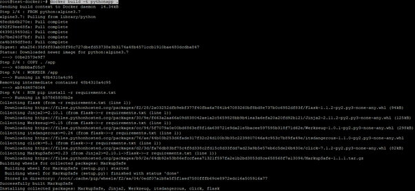

# DAY 1 LABS


### Install Docker

Copy and paste the follwing on Ubuntu VM
``` 
sudo apt install curl
curl -sSL https://get.docker.com/ | sh
sudo usermod -aG docker $(whoami)
```


### Lab 1 - Docker
To perform these labs, kindly connect and login to your linux vm on Azure (https://portal.azure.com), ssh with putty already in your desktop. Run the command – ```  sudo -i ``` To switch to root

1.  What is the version of Docker Server Engine running on the VM?
    
    run the command - ```  docker version ```

    

2.  Check if any containers are running on the host
     
    run the command - ```  docker ps ```

    

3.  Check the number images running on the host 
   
    run the command - ```  docker images ```
    

4.  Run a container with the nginx:latest image and name it webapp
    
    run the command - ```  docker run --name webapp nginx:latest ``` 

    

     #press ctrl + c to terminate the container

5.  Check the number images running on the host 

    run the command - ```  docker images ```

     

6.  Check if any containers are running on the host

    run the command -  ```  docker ps ```
    
    

7.  Check all exited containers

    run the command -```  docker ps -a ```

    

8.  Start the webapp container again
 
    run the command - ```  docker start webapp ```

     

9.  Get the containerid of the webapp container and confirm the port number

     run the command - ```  docker ps -a ```

     


10. Get the ip address of the webapp

     run the command - ```  docker inspect <containerid> | grep “IPAddress” ```

    

 
11. Use curl to confirm the webapp container is running.# This would display a sample page

    run the command -```  curl 172.17.0.2:80 ```

   

12. Run another container Apache and terminate with ctl + c

    run the command - ```  docker run --name apache httpd ```

     

13. Check the number images running on the host 

    run the command - ```  docker images  ```

    


14. Start the webapp container again 

    run the command - ```  docker start apache ```

    

15. Check system-wide information for Docker.

    run the command - ```  docker info ```

     

16. log into a Docker registry
    run the command - ```  docker login ```

    

17. Build a docker image 
    **Open vim editor** _``` vi index.py ```
     ```python
    from flask import Flask
    app = Flask(__name__)

    @app.route("/")
    def hello():
        return "Welcome to AKS Training “

    if __name__ == "__main__":
        app.run(host="0.0.0.0", port=int("5000"), debug=True)
    ```
    **press escape i to edit the file, right click and paste the above python file then press wq! To save and close**

    Create a docker file

    ``` vi Dockerfile ```
    **press escape i to edit the file, right click and paste the below dockerfile  then press wq! To save and close**

    ```YAML
    FROM python:alpine3.7
    COPY . /app
    WORKDIR /app
    RUN pip install -r requirements.txt
    EXPOSE 5000
    CMD python ./index.py
    ```
    Finally create the requirements file requirements.txt

    ``` vi requirements.txt ```
    enter "**flask**" and save(**wq!**)

    Now build the container -
    ``` docker build -t pythonapp . ```  

    Run the container
    ``` docker run -d -p 5000:5000 pythonapp ```

    

    Now to confirm let curl the url - ```curl http://localhost:5000 ```

    

18.	Delete the apache image
    ``` docker stop container-id ```
    ``` docker rmi -f image-id ```
    


### Lab 2 – Kubernetes

 We will setup a kubernetes manually on Azure 


1. **Lab 2.1** - Create a vm on Azure - visit https://shell.azure.com

   **Create a resource group**
   ``` az group create -n CustomKubeCluster -l eastus ``` --

  
 2. **Create a Create Virtual network for the kubernetes cluster**
   ``` az network vnet create -g CustomKubeCluster -n KubeVNet --address-prefix 172.0.0.0/16 --subnet-name MySubnet --subnet-prefix 172.0.0.0/24 ``` 


   

3. **Create Master Node - This will have a public IP**

   ``` az vm create -g "CustomKubeCluster" -n "kube-master" --image "UbuntuLTS" --size Standard_B2s --data-disk-sizes-gb 10  --admin-username "demouser" --admin-password "Demouser@123" --public-ip-address-dns-name kubeadm-master```  

4. **Create the two worker nodes - This will have a public IP** 

   ``` az vm create -g "CustomKubeCluster" -n "kube-worker-1" --image "UbuntuLTS" --size Standard_B2s --data-disk-sizes-gb 10  --admin-username "demouser" --admin-password "Demouser@123" --public-ip-address-dns-name kubeadm-worker-1```  

   

    ``` az vm create -g "CustomKubeCluster" -n "kube-worker-2" --image "UbuntuLTS" --size Standard_B2s --data-disk-sizes-gb 10  --admin-username "demouser" --admin-password "Demouser@123" --public-ip-address-dns-name kubeadm-worker-2```  

5. **Next step is to install docker and kubeadm on all of the nodes. Kindly SSH using Putty into all nodes all run the same set of commands.** 
  ```sudo apt update```
6. **Install Docker**

    ```sudo apt install docker.io -y ``` 
    ```sudo systemctl enable docker ```
7. **Get the gpg keys for Kubeadm**
  ```curl -s https://packages.cloud.google.com/apt/doc/apt-key.gpg | sudo apt-key add ```
  ```sudo apt-add-repository "deb http://apt.kubernetes.io/ kubernetes-xenial main"```
8. **Install Kubeadm**

    ```sudo apt install kubeadm -y ```

9. **Initailze Kubeadm**

    ``` sudo kubeadm init ```
10. **Copy conf file to .kube directory for current user**

    ```mkdir $HOME/.kube```
    ```sudo cp /etc/kubernetes/admin.conf $HOME/.kube/config```
11. **Change ownership of file to current user and group**

    ```sudo chown $(id -u):$(id -g) $HOME/.kube/config```

12. **Now run the join command on the worker nodes**

    ```sudo kubeadm join 172.X.X.X:6443   --token tvbvra.fpp8fXXXXXqn9w  --discovery-token-ca-cert-hash sha256:e61c2bb32f435f7be6fec9f7XXXXc5520e0e2a6385eX9298251238c ```

13. **Install Weave Network(Weave Net provides a network to connect all pods together, implementing the Kubernetes model. Kubernetes uses the Container Network Interface (CNI) to join pods onto Weave Net. Kubernetes implements many network features itself on top of the pod network.)**


    ```kubectl apply -f "https://cloud.weave.works/k8s/net?k8s-version=$(kubectl version | base64 | tr -d '\n')" ```

14. **Check if pods are running**

    ``` kubectl get pods -n kube-system ```

