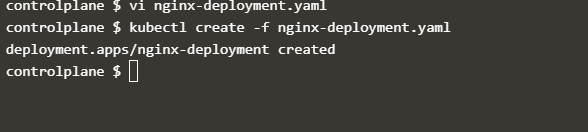

# DAY 2 LABS

### Lab 1 – Kubernetes

For these labs we will be using a web based platform - [Katacoda](https://www.katacoda.com/courses/kubernetes/playground)


1. **Lab 1.1** - Create a redis pod using the imperative and declarative methods

   **Imperative method kubectl**
   ``` kubectl run redis --image=redis ``` --

   

   **Declarative method**

   ``` vi redis-pod.yaml```

    **press escape i to edit the file, right click and paste the below yaml file  then press wq! To save and close**

    ```YAML
    apiVersion: v1
    kind: Pod
    metadata:
        name: redis
    spec:
        containers:
        - name: redis
          image: redis
    ```
    **Now create the pod using the yaml file**
    ``` kubectl create -f redis-pod.yaml ```

    **Check created pods** 
    
    ``` kubectl get pods ```


2. **Lab 1:2** - Create a replicaset of three pods using nginx as your image.

     ``` vi replica-nginx.yaml```

    **press escape i to edit the file, right click and paste the below yaml file  then press wq! To save and close**

```YAML
apiVersion: apps/v1
kind: ReplicaSet
metadata:
  name: nginx
  labels:
    app: nginx
    tier: frontend
spec:
  # modify replicas according to your case
  replicas: 3
  selector:
    matchLabels:
      tier: frontend
  template:
    metadata:
      labels:
        tier: frontend
    spec:
      containers:
        - name: nginx
          image: nginx
```

**Now create the replicaset using the yaml file**
    ``` kubectl create -f replica-nginx.yaml ```

**Check created pods** 
    
``` kubectl get pods ```

     
3. **Lab 1:3** - Create a deployment of 5 replicasets using nginx as your image.

    ``` vi nginx-deployment.yaml```
```YAML
apiVersion: apps/v1
kind: Deployment
metadata:
  name: nginx-deployment
  labels:
    app: nginx
spec:
  replicas: 5
  selector:
    matchLabels:
      app: nginx
  template:
    metadata:
      labels:
        app: nginx
    spec:
      containers:
        - name: nginx
          image: nginx:1.14.2
          ports:
            - containerPort: 80
```
  ``` kubectl create -f nginx-deployment.yaml ```


4. **Lab 1:4** -Create a service to expose a nginx pod on port 8080.

    ``` vi nginx-deployment.yaml```
```YAML
apiVersion: v1
kind: Service
metadata:
  name: my-service
spec:
  selector:
    app: MyApp
  ports:
    - protocol: TCP
      port: 80
      targetPort: 9376
```

``` kubectl create -f service.yaml ```

