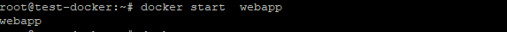
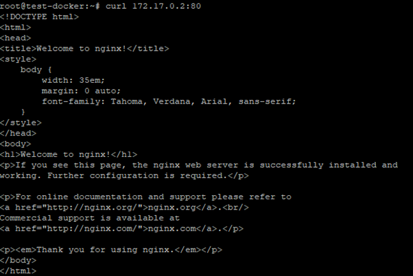
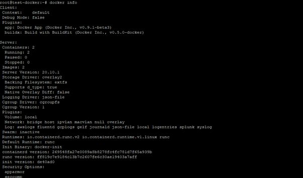
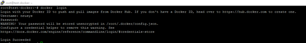

# DAY 1 LABS


### Install Docker

Copy and paste the follwing on Ubuntu VM
``` 
sudo apt install curl
curl -sSL https://get.docker.com/ | sh
sudo usermod -aG docker $(whoami)
```


### Lab 1 - Docker
To perform these labs, kindly connect and login to your linux vm on Azure, ssh with putty already in your desktop. Run the command – ```  sudo -i ``` To switch to root

1.  What is the version of Docker Server Engine running on the VM?
    
    run the command - ```  docker version ```

    

2.  Check if any containers are running on the host
     
    run the command - ```  docker ps ```

    

3.  Check the number images running on the host 
   
    run the command - ```  docker images ```
    

4.  Run a container with the nginx:latest image and name it webapp
    
    run the command - ```  docker run --name webapp nginx:latest ``` 

    

     #press ctrl + c to terminate the container

5.  Check the number images running on the host 

    run the command - ```  docker images ```

     

6.  Check if any containers are running on the host

    run the command -  ```  docker ps ```
    
    

7.  Check all exited containers

    run the command -```  docker ps -a ```

    

8.  Start the webapp container again
 
    run the command - ```  docker start webapp ```

     

9.  Get the containerid of the webapp container and confirm the port number

     run the command - ```  docker ps -a ```

     


10. Get the ip address of the webapp

     run the command - ```  docker inspect <containerid> | grep “IPAddress” ```

    

 
11. Use curl to confirm the webapp container is running.# This ould display a sample page

    run the command -```  curl 172.17.0.2:80 ```

   

12. Run another container Apache and terminate with ctl + c

    run the command - ```  docker run --name apache httpd ```

     

13. Check the number images running on the host 

    run the command - ```  docker images  ```

    


14. Start the webapp container again 

    run the command - ```  docker start apache ```

    

15. Check system-wide information for Docker.

    run the command - ```  docker info ```

     

16. log into a Docker registry
    run the command - ```  docker login ```

    

17. Build a docker image 
    **Open vim editor** _``` vi index.py ```
     ```python
    from flask import Flask
    app = Flask(__name__)

    @app.route("/")
    def hello():
        return "Welcome to AKS Training “

    if __name__ == "__main__":
        app.run(host="0.0.0.0", port=int("5000"), debug=True)
    ```
    **press escape i to edit the file, right click and paste the above python file then press wq! To save and close**

    Create a docker file

    ``` vi Dockerfile ```
    **press escape i to edit the file, right click and paste the below dockerfile  then press wq! To save and close**

    ```YAML
    FROM python:alpine3.7
    COPY . /app
    WORKDIR /app
    RUN pip install -r requirements.txt
    EXPOSE 5000
    CMD python ./index.py
    ```
    Finally create the requirements file requirements.txt

    ``` vi requirements.txt ```
    enter "**flask**" and save(**wq!**)

    Now build the container -
    ``` docker build -t pythonapp . ```  

    Run the container
    ``` docker run -d -p 5000:5000 pythonapp ```

    

    Now to confirm let curl the url - ```curl http://localhost:5000 ```

    

18.	Delete the apache image
    ``` docker stop container-id ```
    ``` docker rmi -f image-id ```
    


### Lab 2 – Kubernetes

For these labs we will be using a web based platform - [Katacoda](https://www.katacoda.com/courses/kubernetes/playground)


1. **Lab 2.1** - Create a redis pod using the imperative and declarative methods

   **Imperative method kubectl**
   ``` kubectl run redis --image=redis ``` --

   

   **Declarative method**

   ``` vi redis-pod.yaml```

    **press escape i to edit the file, right click and paste the below yaml file  then press wq! To save and close**

    ```YAML
    apiVersion: v1
    kind: Pod
    metadata:
        name: redis
    spec:
        containers:
        - name: redis
          image: redis
    ```
    **Now create the pod using the yaml file**
    ``` kubectl create -f redis-pod.yaml ```

    **Check created pods** 
    
    ``` kubectl get pods ```


2. **Lab 2:2** - Create a replicaset of three pods using nginx as your image.

     ``` vi replica-nginx.yaml```

    **press escape i to edit the file, right click and paste the below yaml file  then press wq! To save and close**

```YAML
apiVersion: apps/v1
kind: ReplicaSet
metadata:
  name: nginx
  labels:
    app: nginx
    tier: frontend
spec:
  # modify replicas according to your case
  replicas: 3
  selector:
    matchLabels:
      tier: frontend
  template:
    metadata:
      labels:
        tier: frontend
    spec:
      containers:
        - name: nginx
          image: nginx
```

**Now create the replicaset using the yaml file**
    ``` kubectl create -f redis-pod.yaml ```

**Check created pods** 
    
``` kubectl get pods ```

     
3. **Lab 2:3** - Create a deployment of 5 replicasets using nginx as your image.

    ``` vi nginx-deployment.yaml```
```YAML
apiVersion: apps/v1
kind: Deployment
metadata:
  name: nginx-deployment
  labels:
    app: nginx
spec:
  replicas: 5
  selector:
    matchLabels:
      app: nginx
  template:
    metadata:
      labels:
        app: nginx
    spec:
      containers:
        - name: nginx
          image: nginx:1.14.2
          ports:
            - containerPort: 80
```
  ``` kubectl create -f nginx-deployment.yaml ```


4. **Lab 2:4** -Create a service to expose a nginx pod on port 8080.

    ``` vi nginx-deployment.yaml```
```YAML
apiVersion: v1
kind: Service
metadata:
  name: my-service
spec:
  selector:
    app: MyApp
  ports:
    - protocol: TCP
      port: 80
      targetPort: 9376
```
``` kubectl create -f service.yaml ```


    