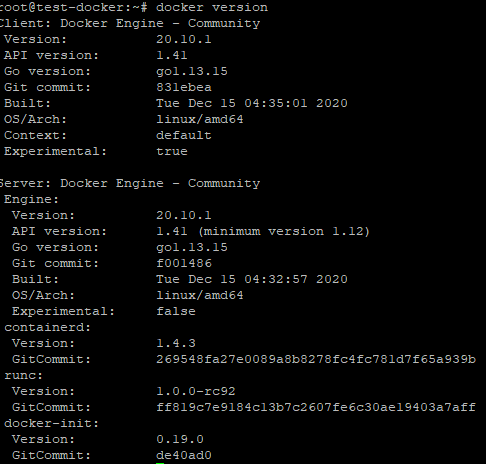
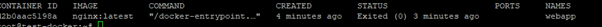
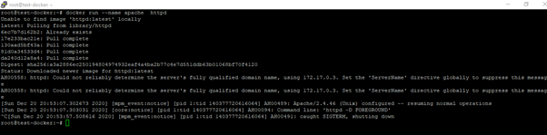

# DAY 1 lABS


### Install Docker

Copy and paste the follwing on Ubuntu VM
``` sh
sudo apt install curl
curl -sSL https://get.docker.com/ | sh
sudo usermod -aG docker $(whoami)
```


#### Lab 1 - Docker
To perform these labs, kindly connect and login to your linux vm on Azure, ssh with putty already in your desktop. Run the command – <sudo -i> To switch to root

1.  What is the version of Docker Server Engine running on the VM ?
    run the command - ``` sh docker version ```
    

2.  Check if any containers are running on the host
     run the command - ``` sh docker ps ```
    

3.	Check the number images running on the host 
    run the command - ``` sh docker images ```
     

4.	Run a container with the nginx:latest image and name it webapp
    run the command - ``` sh docker run --name webapp nginx:latest ``` 
        

      #press ctrl + c to terminate the container

5.	Check the number images running on the host 
    run the command - ``` sh docker images ```
     

6.	Check if any containers are running on the host
    run the command -  ``` sh docker ps ```
    

7.	Check all exited containers
    run the command -``` sh docker ps -a ```
    

8.	Start the webapp container again 
    run the command - ``` sh docker start webapp ```
     

9.	Get the containerid of the webapp container and confirm the port number
     run the command - ``` sh docker ps -a ```
     

10.	Get the ip address of the webapp
     run the command - ``` sh docker inspect <containerid> | grep “IPAddress” ```
    

 
11.	Use curl to confirm the webapp container is running.# This should display a sample page
    run the command -``` sh curl 172.17.0.2:80 ```
   

12.	Run another container Apache and terminate with ctl + c
    run the command - ``` sh docker run --name apache httpd ```
     

13.	Check the number images running on the host 
    run the command - ``` sh docker images  ```
    


14.	Start the webapp container again 
    run the command - ``` sh docker start apache ```
    

15.	Check system-wide information for Docker.
    run the command - ``` sh docker info ```
     
