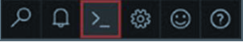
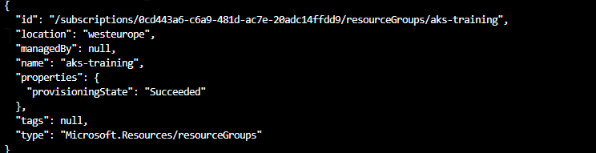
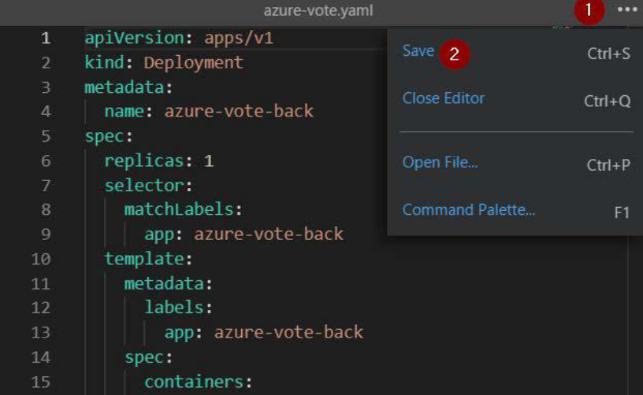
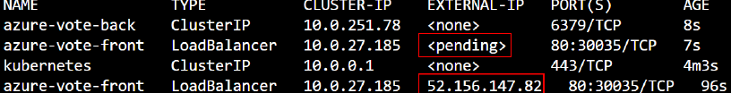
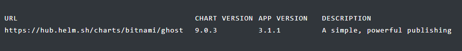

# DAY 2 LABS


### LAB 1 -  Create a Kubernetes cluster through Azure CLI

1. Launch an Azure Cloud Shell session by clicking the Cloud Shell button on the top-right menu bar in the Azure Portal.


  


2. Create a resource group to deploy your AKS cluster by entering the following Azure CLI
command.
   ``` az group create --name aks-training --location westeurope ```

  


3. Use the az aks create command to create the AKS cluster. The following example creates a cluster named akstraining with one node, and the --enable-addons monitoring parameter will enable Azure Monitor for containers for this cluster.
    ``` 
   az aks create --resource-group aks-training --name aks-demo1 --node-count 3 --enable-addons monitoring --generate-ssh-keys
    ```

4. Connect to the Azure AKS cluster

     ``` az aks get-credentials --resource-group aks-training --name aks-demo1 ```


5. Use kubectl to get the number of nodes on the cluster
  

   ``` kubectl get nodes```


6. Clone the application from github

    ``` git clone https://github.com/nonsoUdechukwu/AKS-Training.git ```

7. Enter inside the application directory and view the yaml file
   
   ```
   cd AKS-Training
   cd day2
   cd sampleapp
   code azure-vote.yaml
   ```

    

8. Create the application
   
   ``` kubectl create -f azure-vote.yaml ```

9. Check the progress of the application creation –
   
   ```
   kubectl get pods --watch
   kubectl get pods
   ```

10. To get the public address of the load balancer type the command
   
   ```
   kubectl get service azure-vote-front --watch
   ```
   

11. Note the external IP and type it in a browser


12. Clean up environment. To delete every resource created in Kubernetes for this application, you simply need to delete by the manifest files since everything was created from the file.
   ``` rm -rf azure-vote.yaml ```


### LAB 2 -  How to use Helm to deploy applications on kubernetes

1. Search the Helm Hub for the Ghost chart:
   
   ```
   helm search hub ghost
   ```
   

   This gives you the URL where the chart is located in the central hub. Here you will find all the information about configuration and setup.

2. Add the stable repository:

   ```
   helm repo add stable https://charts.helm.sh/stable
   ```

3. Update the repo to ensure you get the latest chart version:
   

   ```
   helm repo update
   ```

4. The full name for the chart is stable/ghost. You can inspect the chart for more information:
    

    ```
    helm show readme stable/ghost
    ```

    This command’s output will resemble the README text available for the Ghost in the official central hub as linked above.

5. The **helm install** command is used to install a chart by name. It can be run without any  other options, but some charts expect you to pass in configuration values for the chart:
   
   Create a file named **ghost-values.yaml** on your computer for this snippet:

   ```code ghost-values.yaml ```

```YAML
ghostHost: "ghost.example.com"
ghostEmail: "email@example.com"
ghostUsername: "admin"
ghostPassword: "mySecurePassword123!!"
mariadb.mariadbRootPassword: "secretpassword"
```
    Replace the value for **ghostHost** with a domain or subdomain that you own and would like to assign to the app; the value for **ghostEmail** with your email; the values for **ghostUsername** and **ghostPassword** with the credentials you wish to use for logging into your site; and the value for **mariabd.mariadbRootPassword** for the password you wish to use for logging into the database.

6. Run the install command and pass in the configuration file:
   
   ```
   helm install --values=ghost-values.yaml stable/ghost --generate-name
   ```

7. The install command returns immediately and does not wait until the app’s cluster objects are ready. You will see output like the following snippet, which shows that the app’s pods are still in the “Pending” state. The text displayed is generated from the contents of the chart’s templates/NOTES.txt file:

8. Helm has created a new release and assigned it a random name. Run the ls command to get a list of all of your releases:
   
   ```
   helm ls
   ```

10. You can check on the status of the release by running the status command:
    
    ```
    helm status ghost-56r36363
    ```


