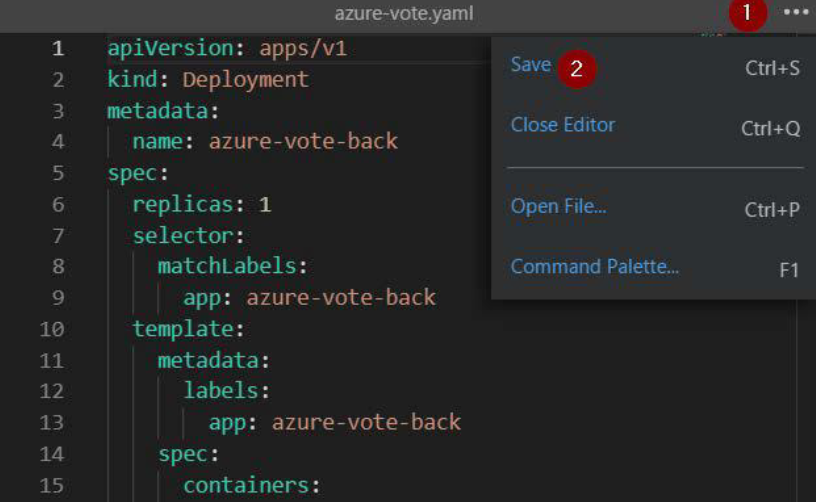

# DAY 3 LABS


### LAB 1 -  Create a Kubernetes cluster through Azure CLI

1. Launch an Azure Cloud Shell session by clicking the Cloud Shell button on the top-right menu bar in the Azure Portal.


  


2. Create a resource group to deploy your AKS cluster by entering the following Azure CLI
command.
   ``` az group create --name aks-training --location westeurope ```

  


3. Use the az aks create command to create the AKS cluster. The following example creates a cluster named akstraining with one node, and the --enable-addons monitoring parameter will enable Azure Monitor for containers for this cluster.
    ``` 
   az aks create --resource-group aks-training --name aks-demo1 --node-count 3 --enable-addons monitoring --generate-ssh-keys
    ```

4. Connect to the Azure AKS cluster

     ``` az aks get-credentials --resource-group aks-training --name aks-demo1 --admin ```


5. Use kubectl to get the number of nodes on the cluster
  

   ``` kubectl get nodes```


6. Clone the application from github

    ``` git clone https://github.com/nonsoUdechukwu/AKS-Training.git ```

7. Enter inside the application directory and view the yaml file
   
   ```
   cd AKS-Training
   cd day3
   cd sampleapp
   code azure-vote.yaml
   ```

    

8. Create the application
   
   ``` kubectl create -f azure-vote.yaml ```

9. Check the progress of the application creation –
   
   ```
   kubectl get pods --watch
   kubectl get pods
   ```

10. To get the public address of the load balancer type the command
   
   ```
   kubectl get service azure-vote-front --watch
   ```
   

11. Note the external IP and type it in a browser


12. Clean up environment. To delete every resource created in Kubernetes for this application, you simply need to delete by the manifest files since everything was created from the file.
   ``` kubectl delete -f azure-vote.yaml ```
   ``` rm -rf azure-vote.yaml ```


### LAB 2 -  Deploy a sample WordPress application using Helm 


1. Create a MySQL server with MySQL version 8.0 in your resource group  and provide a server admin login  and a strong password.

   ``` az mysql server create --resource-group aks-training --name mydemoserver  --location eastus --admin-user myadmin --admin-password  --sku-name GP_Gen5_2 --version 8.0  --ssl-enforcement disabled --tags AppProfile:WordPress  ```


2.  create the database by running the following command:

     ``` az mysql db create --resource-group aks-training --server-name mydemoserver --name wpdatabase ```

3. Create a firewall rule  to allow all Azure-internal IP addresses to access your Server

   ```az mysql server firewall-rule create --resource-group myresourcegroup --server-name mydemoserver –-name allowanyazureIPs --start-ip-address 0.0.0.0 --end-ip-address 0.0.0.0 ```

4. Create a firewall rule to connect to your server from your local environment.
   
   ```az mysql server firewall-rule create --resource-group myresourcegroup --server-name mydemoserver –-name allowmyIP --start-ip-address   --end-ip-address  ```

5. Create a new directory for your project settings in your local environment.
   
   ```mkdir myblog   ```

   ```cd myblog ```

6. Next, create a file named values.yaml using any text editor of your choice. This file will be used to set up a few  parameters that will define how WordPress connects to the database and some

7. Copy the values.yaml file below. Please update the database information with your MySQL database and blog Information below. DO NOT forget to disable MariaDB as shown in the final section. edit the values on the /helm/values.yaml
   
8. Now let’s execute helm to install WordPress. The following command tells helm to add the Bitnami Helm Chart repository so you can access all of their helm charts. 

   ```helm repo add bitnami https://charts.bitnami.com/bitnami  ```

9. Now that we have access to the Bitnami repository, use helm to install the WordPress chart under the name myblog, using values.yaml as configuration file:
   
   ```helm install --name myblog -f /helm/values.yaml stable/wordpress ```

10. After the installation is complete, a service named myblog-wordpress is created within your Kubernetes cluster. This may take a few minutes before the container is ready and the  External-IP information is available. To check the status of this service and retrieve its external IP address, run:
        ```kubectl get services ```

